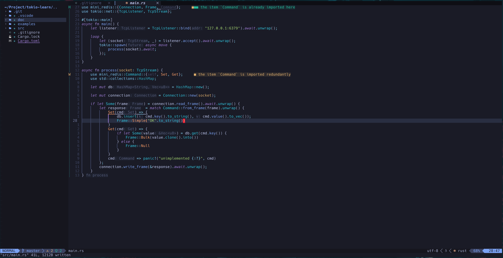

# Neovim Configure

## Install 
```bash
git clone https://github.com/lywa1998/nvim.git ~/.config/nvim
```

## Screenshot


## KeyMap

- Terminal
    1. <Esc>: 't' mode, 't' mode -> 'n' mode 
    2. <leader>tn: 'n' mode, New terminal
    3. <leader>tq: 'n' mode, Quit terminal
